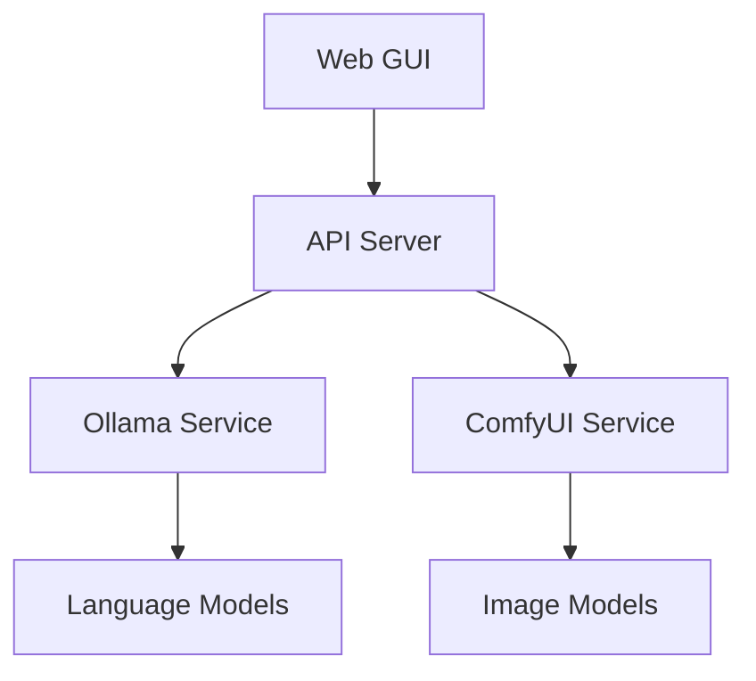

# DinoAir Project Documentation

## Overview

DinoAir is an innovative AI-powered assistant that combines image generation capabilities with conversational AI. This document provides a comprehensive guide for developers and users.

## Table of Contents

1. [Getting Started](#getting-started)
2. [Architecture](#architecture)
3. [API Reference](#api-reference)
4. [Configuration](#configuration)
5. [Troubleshooting](#troubleshooting)

## Getting Started

### Prerequisites

Before you begin, ensure you have the following installed:

- **Python 3.11+** - Required for running the backend services
- **Node.js 18+** - Required for the web interface
- **Ollama** - For running language models locally
- **Git** - For cloning the repository

### Installation

1. Clone the repository:
   ```bash
   git clone https://github.com/your-org/dinoair.git
   cd dinoair
   ```

2. Run the installer:
   ```bash
   python install.py
   ```

3. Start the application:
   ```bash
   python start.py
   ```

## Architecture

### System Components



### Key Technologies

- **Frontend**: Next.js, React, TypeScript, Tailwind CSS
- **Backend**: Python, FastAPI
- **AI Services**: Ollama (LLM), ComfyUI (Image Generation)
- **Storage**: Local file system for artifacts

## API Reference

### Health Check Endpoint

```http
GET /api/health
```

Returns the health status of all services:

```json
{
  "overall": "healthy",
  "services": {
    "ollama": {
      "status": "healthy",
      "message": "Ollama is running and accessible"
    },
    "comfyui": {
      "status": "healthy",
      "message": "ComfyUI is running and accessible"
    }
  },
  "timestamp": "2024-01-15T10:30:00Z"
}
```

### Chat Endpoint

```http
POST /api/chat
Content-Type: application/json

{
  "message": "Your message here",
  "context": []
}
```

## Configuration

### Environment Variables

| Variable | Description | Default |
|----------|-------------|---------|
| `OLLAMA_HOST` | Ollama service URL | `http://localhost:11434` |
| `COMFYUI_HOST` | ComfyUI service URL | `http://localhost:8188` |
| `PORT` | Web GUI port | `3000` |

### Model Configuration

Models can be configured in the `config.json` file:

```json
{
  "llm": {
    "model": "qwen:7b-chat-v1.5-q4_K_M",
    "temperature": 0.7
  },
  "image": {
    "model": "sd_xl_base_1.0",
    "steps": 20
  }
}
```

## Troubleshooting

### Common Issues

#### Services Not Starting

If services fail to start, check:

1. Port availability (3000, 8188, 11434)
2. Python and Node.js versions
3. Sufficient disk space for models

#### Model Download Failures

If model downloads fail:

1. Check internet connection
2. Verify sufficient disk space (>10GB recommended)
3. Try manual download using `python download_models.py`

#### Performance Issues

For better performance:

1. Use GPU acceleration if available
2. Adjust model parameters in configuration
3. Consider using smaller model variants

### Getting Help

- **GitHub Issues**: Report bugs and request features
- **Discord**: Join our community for real-time support
- **Documentation**: Check our wiki for detailed guides

---

## Contributing

We welcome contributions! Please see our [Contributing Guide](CONTRIBUTING.md) for details.

## License

This project is licensed under the MIT License - see the [LICENSE](LICENSE) file for details.